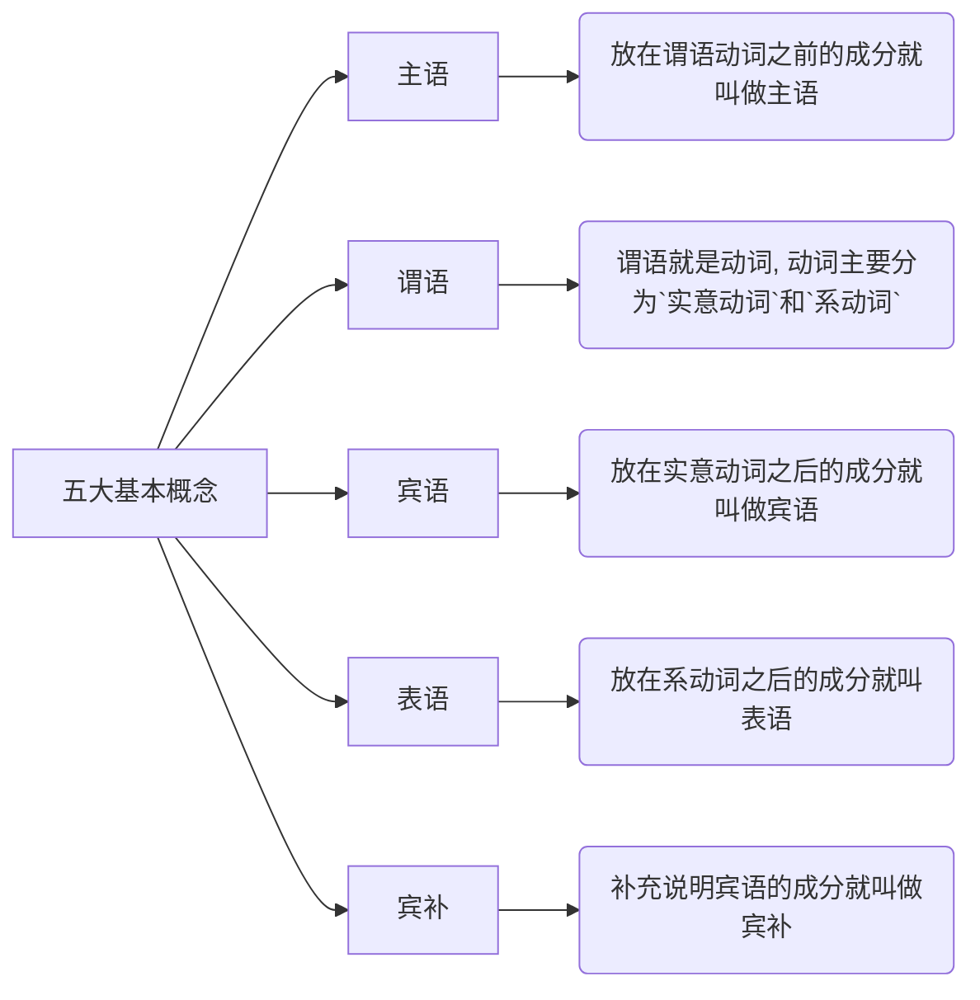
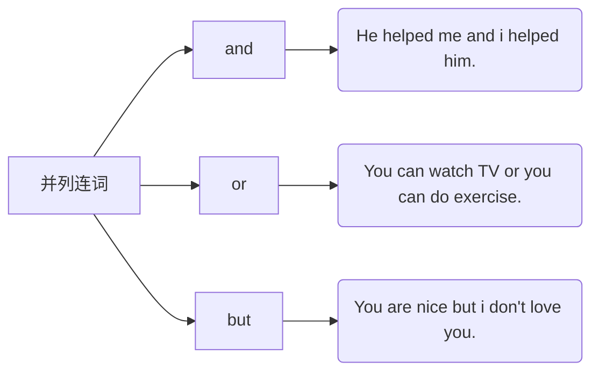
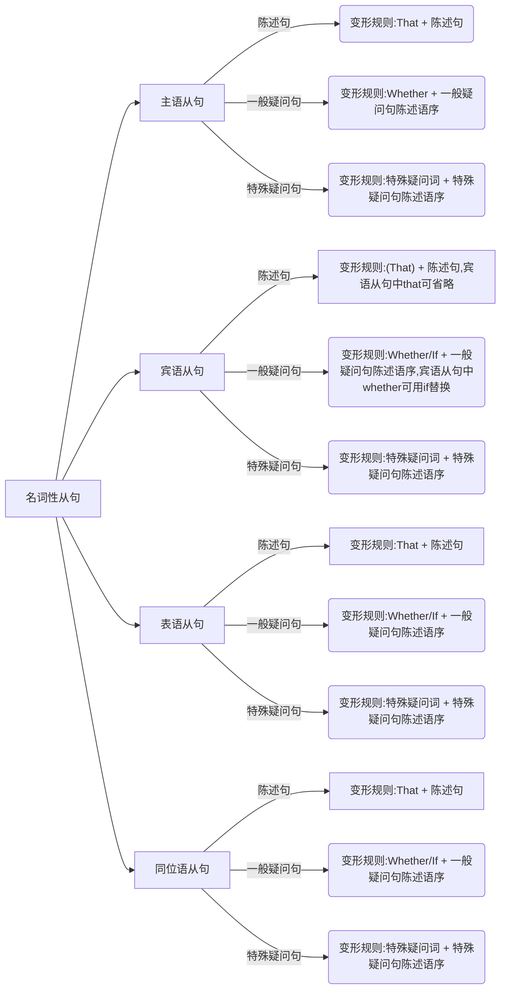
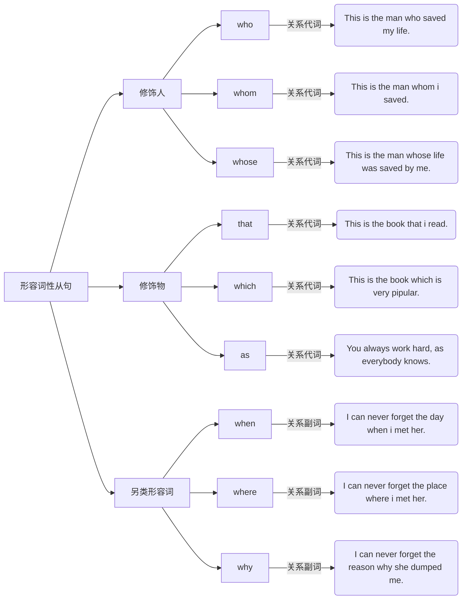
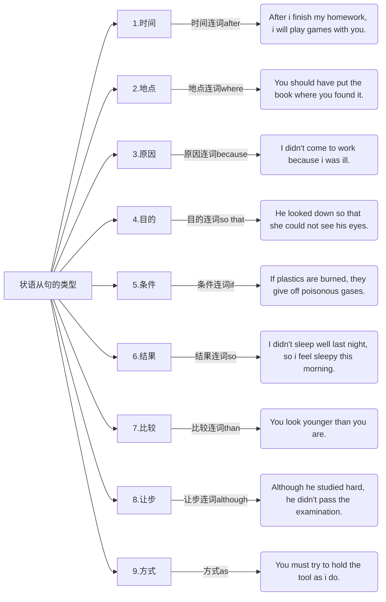
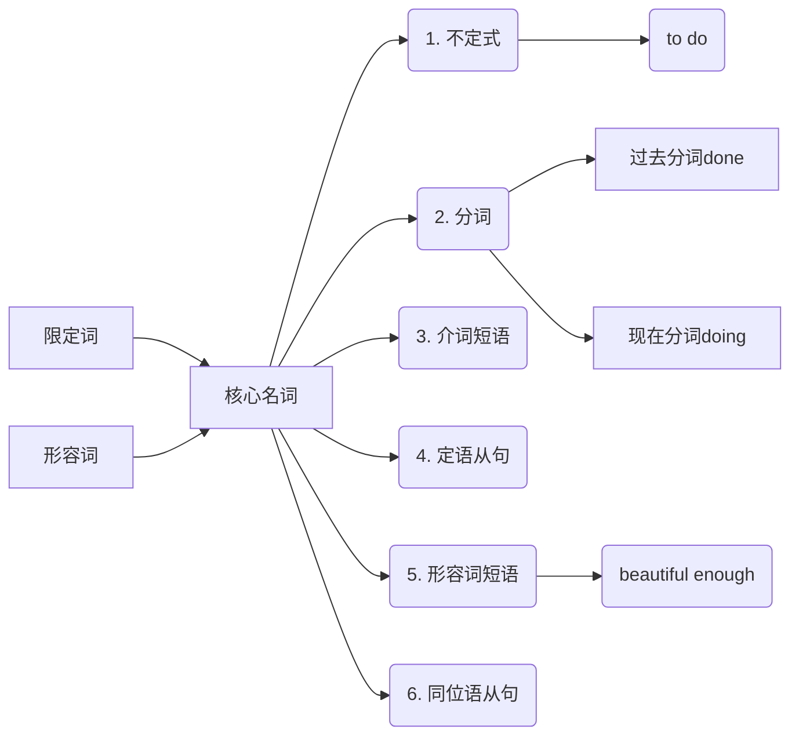
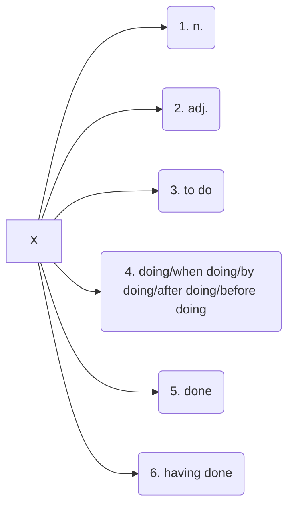

# Grammer

Grammer study.

Contents：

- 五大基本概念
- 五大基本句型
- 并列句的起源与本质
- 名词性从句的起源于本质
- 形容词性从句（定语从句）的起源于本质
- 副词型从句（状语从句）的起源于本质
- 长难句必杀技一 ———— “左二右六原则”
- 长难句必杀技二 ———— “悬挂结构”
- 四大特殊句型：强调句；倒装句；虚拟语气；独立主格
- 时态轴 ———— 英语时态的秘密

* * *

## 五大基本概念



1. 主语
放在谓语动词之前的成分就叫做主语。

2. 谓语
谓语就是动词，动词主要分为`实意动词`和`系动词`

    ```mermaid
    graph LR;
        谓语动词 --> 1.实意动词;
        谓语动词 --> 2.系动词;
        谓语动词 --> 3.助动词;
        谓语动词 --> 4.情态动词;
        1.实意动词 --> 具备实际动作意义;
        2.系动词 --> be动词;
        2.系动词 --> 和be功能一样的动词;
        3.助动词 --> be,have,has,had,do,did;
        4.情态动词 --> can,may,must,should,would;
    ```

    1. 实意动词：具备实际动作意义
    2. 系动词
        1. be动词包含：is am are was were
        2. 和be功能一样的动词
    3. 助动词包含：be、has、hava、had、do、did（时态语态相关）
    4. 情态动词包含：can、may、must、should、would

    ```text
    例句：
    1. I love you.
    2. To see is to believe.
    3. The flower smells great.
    4. Being able to love you is the happest thing in this world.
    ```

3. 宾语
放在实意动词之后的成分就叫做宾语。

4. 表语
放在系动词之后的成分就叫做表语。

5. 宾补
补充说明宾语的成分就叫做宾补。

    ```text
    1. I find you beautiful.
    2. I consider him a liar.
    3. I hear her signing.
    ```

    >Tip：
    >
    >>如果宾语和宾语之后的成分加be动词后能够构成一个逻辑完整的句子，则宾语之后的成分为宾补。

    思维导图：

    ```mermaid
    graph LR;
        主语+谓语 --> 实意动词;
        主语+谓语 --> 系动词;
        实意动词 --> 宾语;
        系动词 --> 表语;
        宾语 --> 宾补;
    ```

* * *

## 五大基本句型

1. 主语 + 谓语

    e.g. I arrived / The rain stopped.

2. 主语 + 谓语 + 宾语

    e.g. I love you.

3. 主语 + 谓语 + 宾语 + 宾语

    e.g. My mum bought me a drink.

4. 主语 + 谓语 + 宾语 + 宾补

    e.g. I find you beautiful.

5. 主语 + 系动词 + 表语

    e.g. I am good.

>Tip:
>
>> 1.五大基本句型是万万句之源
>>
>> 2.一个句子的主干有且仅有一个谓语动词

### 补充定义

定语和状语

1. 状语

    除去五大基本概念和形容词（定语）剩下的部分就是状语。

    教科书定义：说明地点、时间、原因、目的、结果、条件、方向、程度、方式和伴随状况等的句子叫做状语。

    >Tip:
    >
    >>介词短语几乎都是状语

2. 定语
形容词

### 例句1

1. 主+谓

    - He cried.
    - The bus stopped.
    - It is raining now. （时间状语）
    - We have worked for 5 days. （时间状语）
    - Dark clouds hung overhead. （方向状语）
    - Gradually a smile appreared on her face. (伴随和地点状语)
    - He is smiling all over his face. (地点方位状语)
    - I did well in English. (程度状语)
    - He talked loudly in the classroom yesterday. (多状语)

2. 主+谓+宾

    - I love you.
    - People all over the world speak English. (范围状语)
    - He did not know what to say. (what to say 作宾语)
    - He practive speaking English every day.
    - He is having dinner at home now.

3. 主+谓+宾+宾

    - He lent me some money.
    - She orderd herself a new dress.
    - She cooked her husband a delicious meal.
    - I showed him my pictures.
    - He showed me how to run the machine.

4. 主+谓+宾+宾补

    - he asked me to lend him some money. （“be + to do” 表示将来时结构作宾补）
    - Our teacher encourages us to do more reading.
    - I heard someone calling for help. ("doding" 结构作宾补)
    - We saw her entering the room.
    - His father named him Dongming.
    - Let the fresh air in.
    - We saw him out.
    - He kept his hands behind his back.
    - I want your homework done on time.
    - I'll have my bike repaired. ("have + sth. done")
    - I'll have my hair cut.
    - They painted their boat white.

5. 主+系+表

    - His advice proved right.
    - The shop stays open till 8 o'clock.
    - The mechine went wrong.
    - All these efforts seem in vain.
    - The room soon became crowded.
    - The days are getting longer and longer.
    - He fell ill yesterday.
    - Trees turn green i spring.
    - What you said sounds great.
    - He tasted the food, and the food tasted delicious.
    - The book sill lies open on the desk.

* * *

## 并列句的起源与本质

简单句 + 并列连词 + 简单句.

You are nice but i don't love you.



## 名词性定语从句的起源与本质

一个句子做了名词的功能就叫做名词性从句。



### 规则

1. 变化规则：that + 陈述句 = 名词

    That Yaoming is tall is a fact.

    ```mermaid
    graph LR;
        名词性从句 -- 陈述句 --> 主语从句;
        主语从句 --> A(That Yaoming is tall is a fact.);
        名词性从句 -- 陈述句 --> 宾语从句;
        宾语从句 --> B["We know (that) Yaiming is tall."];
        名词性从句 -- 陈述句 --> 表语从句;
        表语从句 --> C(My option is that Yaoming is tall.);
        名词性从句 -- 陈述句 --> 同位语从句;
        同位语从句 --> D(The option that Yaoming is tall is right.);
    ```

2. 变化规则：if/whether + 一般疑问句的陈述语序 = 名词

    一般疑问句：Will you come to Bejing tomorrow?

    ```mermaid
    graph LR;
        名词性从句 -- 一般疑问句 --> 主语从句;
        主语从句 --> 1.你明天是否来北京对我来说很重要.;
        主语从句 --> A(Whether you will come to Bejing tomorrow is impotant to me.);
        名词性从句 -- 一般疑问句 --> 宾语从句;
        宾语从句 --> 2.我想知道你明天是否来北京.;
        宾语从句 --> B(I want to know if/whether you will come to Bejing tomorrow.);
        名词性从句 -- 一般疑问句 --> 表语从句;
        表语从句 --> 3.我的问题是你明天是否来北京.;
        表语从句 --> C(My question is whther you will come to Bejing tomorrow.);
        名词性从句 -- 一般疑问句 --> 同位语从句;
        同位语从句 --> 4.你明天是否来北京这个问题让我很烦心.;
        同位语从句 --> D(The question whether you will come to Bejing tomorrow bothers me.);
    ```

3. 变化规则：陈述语序的特殊疑问句 = 名词

    特殊疑问句：Why are you so clever.

    ```mermaid
    graph LR;
        名词性从句 -- 特殊疑问句 --> 主语从句;
        主语从句 --> 1.你为什么这么聪明是一个谜.;
        主语从句 --> A(Why you are so clever is a mystery.);
        名词性从句 -- 特殊疑问句 --> 宾语从句;
        宾语从句 --> 2.我们不知道你为什么这么聪明.;
        宾语从句 --> B(We don't know why you are so clever.');
        名词性从句 -- 特殊疑问句 --> 表语从句;
        表语从句 --> 3.我的问题是你为什么这么聪明.;
        表语从句 --> C(My question is why you are so clever.);
        名词性从句 -- 特殊疑问句 --> 同位语从句;
        同位语从句 --> 4.你为什么这么聪明这个问题让我感兴趣.;
        同位语从句 --> D(The question why you are so clever interest.);
    ```

4. 特殊疑问词

    ```mermaid
       graph LR;
       特殊疑问词 --> 人-2;
       特殊疑问词 --> 物-2;
       特殊疑问词 --> 特殊-3;
       特殊疑问词 --> How-1;
       人-2 --> Who;
       人-2 --> Whose;
       物-2 --> Which;
       物-2 --> What;
       特殊-3 --> When;
       特殊-3 --> Where;
       特殊-3 --> Why;
       How-1 --> How;
    ```

>Tips:
>
>>1. 在句子中遇到“抽象名词”时，应条件反射地想到后面可能跟了同位语从句，常跟同位语从句的抽象名词有：\
>>belief(信念)、fact(事实)、idea(主意)、problem(问题)、information(消息)、conclusion(结论)、decision(决定)、news(新闻)、thought(想法)、explanation(解释)等
>>
>>2. 当同位语从句充当主语过长时，同位语从句和它所修饰的名词常常隔开（避免`头重脚轻`，比如It's a fact that...）。\
>>An idea came to her that she cloud solve the problem in another way.\
>>她想到她可以用另一种方法解决问题。

### 例句2

1. 五大基本句型

    - What he does is important.  ————  [主语从句 + (主+系+表)结构]
    - I don't like what he does every day.  ————  [宾语从句 + (主+谓+宾)结构]
    - This is what he does every day.  ————  [表语从句 + (主+系+表)结构]
    - I don't know the fact that he is a teacher.  ————  [同位语从句 + (主+谓+宾)结构]
    - I wonder(=want to know) who will teach us. ————  [宾语从句 + (主+谓+宾)结构]
    - Mr. Wang asked whose book that was. ————  [宾语从句 + (主+谓+宾)结构]
    - The news that we won the game is exciting. ————  [同位语从句 + (主+系+表)结构]
    - You can do what you think is right. ————  [宾语从句 + (主+谓+宾)结构] 隐含一个定语从句
    - Whoever smokes here will be punished. ————  [主语从句 + (主+谓)结构]
    - Whatever you say is of no use now. ————  [主语从句 + (主+系+表)结构]
    - You can take whatever you like. ————  [主语从句 + (主+谓+宾)结构]
    - Whatever he likes will be given to him. ————  [主语从句 + (主+谓+宾)结构]
    - Lily wanted to know if her grandma liked the handbag. ————  [宾语从句 + (主+谓+宾)结构]
    - It all depends on whether she likes the boss or not. ————  [宾语从句 + (主+谓+宾)结构]
    - None of us knows where these new parts can be bought. ————  [宾语从句 + (主+谓+宾)结构]
    - I have heard that he will come tomorrow. ————  [宾语从句 + (主+谓+宾)结构]
    - His brother asks when he will go to the library. ————  [宾语从句 + (主+谓+宾)结构]
    - I don't know what he wants to buy. ————  [宾语从句 + (主+谓+宾)结构]
    - Can you tell me who we are going to meet？ ————  [同位语从句 + (主+谓+宾+宾语)结构]
    - Could you tell us which gate we have to go to? ————  [同位语从句 + (主+谓+宾+宾)结构]
    - Could you please tell me how you use the new panel? ————  [同位语从句 + (主+谓+宾+宾)结构]
    - Could you tell us how much it costs to fly to Hainan? ————  [同位语从句 + (主+谓+宾+宾)结构]
    - Could you tell us how often you go abroad for a holiday? ————  [同位语从句 + (主+谓+宾+宾)结构]
    - Could you tell us how long the meeting will last? ————  [同位语从句 + (主+谓+宾+宾)结构]
    - I don't know how far it is to the cinema. ————  [宾语从句 + (主+谓+宾)结构]
    - Please tell us how many students there are in your school. ————  [同位语从句 + (主+谓+宾+宾)结构]
    - Can you tell us how old his brother is? ————  [同位语从句 + (主+谓+宾+宾)结构]
    - Please tell us how soon you will be ready. ————  [同位语从句 + (主+谓+宾+宾)结构]

### 现有语法结构体系无法解释句型

表达人的心情时常常用的句型的主干我们是比较难理解的，这一类句子当做固定句型记忆即可。e.g.

1. I'm afraid (that) he won't pass the exam.
2. We are sure that he will be successful soon.
3. I'm glad that you come to see me.

* * *

## 形容词性从句（定语从句）的起源于本质

一个句子做了形容词的功能就叫做形容词性从句。

I like that beautiful `girl` `who` can speak good English.

- `先行词`:girl
- `关系词`:who

>从句连词：who、whom、whose、that、which、as、when、where、why.



>Tips:
>
>>1. as不可指代具体的某个词，一般指某事件，其引导的定语从句可以至于句首（其他定语从句不可以），也可以至于句末。as在定语从句中通常翻译为`正如`。
>>  
>>      e.g. A is planned, we got there before eight. (正如计划，我们在八点之前到那了。)\
>>      The won the game, as we had expected. (他们赢得了比赛，正如我们预料的那样。)
>>
>>2. 固定搭配:\
>>      such/so...as...\
>>      the same...as...\
>>      reason + why
>>
>>      e.g. He is not such a fool as he looks. (他并没有看上去那么傻。)
>>
>>3. that不出现在包含逗号`,`的定语从句中；也不和介词搭配使用。
>>
>>4. 逗号`,`出现的定语从句通常翻译为两句话。\
>>      4.1. I like the girl who is beautiful. (我喜欢这个漂亮的女孩)\
>>      4.2. I like the girl, who is beautiful. (我喜欢这个女孩，因为她漂亮)
>>
>>5. that既可以指代人，也可以指代物。通常that可以与who、whom和which互换。
>>
>>6. 关系副词when、where、why使用规则，右边必须紧跟指代时间、地点和reason，右边必须接一个完整的句子（符合五大基本句型且意义完备的句子）。
>>
>>7. 当`way`和`time`做定语从句的先行词时，关系代词常常省略。\
>>      7.1. I don't like the way (that/in which) he treated me.\
>>      7.2. The way (that/in which) he explained to us is quite simple.\
>>      7.3. This is the time (that) i come here.\
>>      7.4. This is the last time (that) i shall give you a lesson.
>>

### 限制性定语从句和非限制性定语从句

1. 限制性定语从句

    She despised people who flattered her. (她看不起那些吹捧她的人)

    定语从句“who flattered her”起到了限制先行名词的作用（即缩小名词的表示范围），归类为限制性定语从句。

2. 非限制性定语从句

    在某些场景下，先行词的指向已经是唯一的了，此时就无法再缩小这个先行词的表示范围了。所以非限制性定语从句的作用不直接修饰先行词，只为先行词提供一些补充的信息。

    I made a card for mom, who loves me most.

    所谓的非限制性定语从句，就是用逗号`,`将定语从句与先行词隔开。

### 例句3

- I like climbing mountains, which is good for my health.
- This is the room, in which i spent my whole childhood.
- The man who/that is speaking at the meeting is a worker.
- These are the trees that/which were planted last year.
- The woman whom they wanted to visit is a teacher.
- I know the girl whose mother is a teacher.
- I have a friend who/that likes listening to classical music.
- The speed at which you drive your car mustn't be too high.
- The man to whom i talked is Mr. Li.
- I don't like the way in which you speak to her.
- Is this the library from which you borrow books?
- The wolf by which the sheep was killed was shot.
- He is such a nice person as is popular.
- It is such a beautiful picture as attracted many people.
- As you've pointed out, he proves to be the best student here.
- As we all know, the earth is round.
- I'll never forget the days which/that we spent together.
- I'll never forget the day when i joined the league.
- This is the house where i lived two years ago.
- Do you know the reason why she was late?

* * *

## 副词型从句（状语从句）的起源于本质

一个句子做了副词的功能就叫做副词性从句。

I love you as a mouse loves rice.

> 完整句子1 + 连词 + 完整句子2  
> 其中（连词 + 完整句子2）为状语从句/副词性从句

### 副词

定义：那些修饰动词、形容词和整个句子的可有可无的成分叫做副词。

- I love you deeply.
- You are beautiful enough.
- I have breakfast every day.

>Tips:
>
>>1. 副词就是状语，状语就是副词。
>>2. 那些修饰动词、形容词和整个句子的可有可无的成分叫做副词，也叫做状语。
>>3. 除去五大基本概念和定语后剩下的成分就是副词，就是状语。
>>4. 说明时间、地点、原因、目的、结果、条件、方向、程度、方式和伴随状况等。

#### 例句4

- The boy needs a pen ~~very much~~. (程度)
- The boy ~~really~~ needs a pen. (程度)
- He went ~~there yesterday~~. (地点+时间)
- It ~~suddenly~~ rained. (方式)
- I ~~often~~ read English ~~loudly in the morning~~. (频率+程度+时间)
- I ~~seldom~~ go to the movies. (频率)
- We have worked ~~for 5 days~~. (时间)
- Dark clouds hung ~~overhead~~. (地点)
- ~~Gradually~~ a smile appeared ~~on her face~~. (方式+地点)
- He is smiling ~~all over his face~~. (地点)
- I did ~~well in English~~. (程度+地点)
- He talked ~~loudly in the classroom yesterday~~. (程度+地点+时间)
- People ~~all over the world~~ speak English. (地点)
- He is having dinner ~~at home now~~. (地点+时间)

### 副词性从句



### 例句5

- `While/When/As` John was watching TV, his wife was cooking.
- You'd better think twice `before` you make your decision.
- It is a month `since` i met him last time.
- It has been five years `since` i taught English.
- I found the world was amazing `after` i wnet abroad.
- I waited `until` he came.
- I didn't have a boyfriend `until` i was 17 years old.
- `Whenever` a visitor comes into a house, he is served with a cup of tea.
- `Each time` i went there i saw him working.
- `Every time` i listened to your advice i got into trouble.
- `By the time` he was taken to the hospital he was almost dead.
- `Next time` you come to class, please remember to take your notes.
- `The first time` i saw you i fell in love with you.
- He didn't tell me the news `the last time` i saw him.
- People check messages `as soon as` we wake up.
- The children ran away from the garden `the moment` they saw the guard.
- I want to see him `the minute` he arrives.
- `Once` he arrives we can start.
- `Hardly` had he reached the school gate `when` the bell rang.
- I had `o sooner` arrived home `than` it began to rain.
- Generally, air will be heavily polluted `where` there are factories.
- `Wherever` you go, you should work hard.
- `Where` there is no rain, farming is difficult or impossible.
- My friends dislike me `because` i'm handsome and successful.
- `Now that` everybody has come, let's begin our conference.
- The higher income tax is harmful `in taht` it may discourage people from trying to earn more.
- The teacher uses simple examples `so that` his students could understand him.
- He got up `so` early `that` he caught the first bus.
- It's `such` a good change `that` we must not miss it.
- We'll start our project `if` the president agrees.
- You will certainly succeed `as long as` you keep on trying.
- The old man always enjoys swimming `even though` the weather is bad.
- `No matter` how hard he tried, she could not change her mind.
- He won't listen `whatever` you may say. => He won't listen `no matter` what you may say.
- I will support you `whichever` you choose. => I will support you `no matter` which you choose.

>Tips:
>
>> 时间状语从句尤为常见。
>>
>> 1. 常见的时间状语连词：
>>      when/while/as/before/after/since/till/untill
>> 2. "一...就..."系列:
>>      as soon as/the moment/the second/the minute/once/hardly...when.../no sooner...than...
>> 3. Time系列:
>>      every time/each time/next time/the last time/the first time/by the time.
>>

* * *

## 长难句必杀技一 ———— “左二右六原则”

左二右六原则.



### 限定词

语法：限定词是指在名词词组中对中心名词起特指，类指及表示确定数量和非确定数量作用的词表。

> 限定词分类：
>
>> 1. 冠词：a, an, the
>> 2. 形容词性代词：my, your, his, her, its, their
>> 3. 量词：a number of, plenty of, some ...

### 例句6

简单句型：The beautiful girl is Angelababy.

- The `beautiful` girl `to get married` is Angelababy. (不定式)
- The `beautiful` girl `wearing sunglasses` is Angelababy. (现在分词)
- The `beautiful` girl `hugged by HXM` is Angelababy. (过去分词)
- The `beautiful` girl `in blue jeans` is Angelababy. (介词短语)
- The `beautiful` girl `who is the leading actress in running man` is Angelababy. (定语从句)
- The `beautiful` girl `slim enough` is Angelababy. (形容词短语)
- The question `whether the beautiful girl is Angelababy` has an answer. (同位语从句)
- I have many letters `to write`. (不定式)
- The letter `to be written` is to my father. (不定式)
- We have made a plan `to learn from Lei Feng`. (不定式)
- He made a promise `to come here on time tomorrow`. (不定式)
- We got the order `to leave the city`. (不定式)
- The dog `lying on the ground` is mine. (现在分词)
- People `exercising every day` live longer. (现在分词)
- They built a road `leading into the mountains`. (现在分词)
- We met a group of pupils `returning from school`. (现在分词)
- Surely, someone `passing by` would see it. (现在分词)
- This is a film `directed by Feng Xiaogang`. (过去分词)
- What is the language `spoken in Spain`? (过去分词)
- People got water by dropping a bucket `tied to a rope`. (过去分词)
- The reading time `spent on them` is getting longer. (过去分词)
- He told me to watch the circles `created by the stone`. (过去分词)
- The bird `on the tree` flied away. (介词短语)
- The road `to the school` is not wide. (介词短语)
- The basic idea `behind the festival` remains the same. (介词短语)
- We know China is a country `with a large population`. (介词短语)
- Questions `about the competition` can be emailed to 51@qq.com. (介词短语)
- Italian is a language `very difficult to learn`. (形容词短语：形容词+to do.)
- He looked at her eyes `full of tears`. (形容词短语)
- I know the actor `suitable for the role`.  (形容词短语)
- I know it is a city `famous for kites`. (形容词短语)
- I know now that i am not the only one `uncertain about future sutuies`. (形容词短语)
- The fact `that she didn't like me` really hurts me. (同位语从句)
- The general gave the order `that the soldiers should cross the river at once`. (同位语从句)
- I received the message `that he won't be able to see me tomorrow`. (同位语从句)
- The suggestion `that he plan should be delayed` will be discussed tomorrow. (同位语从句)
- The news `that our team has won the game` is true. (同位语从句)
- They expressed the hope `that they would come to visit Bejing again`. (同位语从句)
- Many British parents hold the view `that teenagers shouldn't spend too much time online`. (同位语从句)
- We'll discuss the problem `whether the sports meeting will be held on time`. (同位语从句)
- In the video, young people `from 20 countries` `along the Belt and Road(一带一路) routes` were asked to name great inventions `that had influenced their lives in China`.
- People's knowledge and ideas `about Scotsmen` `wearing these funny kilts` come from films and television.
- This book can give you the answers `to the questions` most often `asked by parents, teachers and students themselves`.

* * *

## 长难句必杀技二 ———— “悬挂结构”

规则：`主+谓+宾，悬挂X` 或者 `悬挂X，主+谓+宾`，悬挂结构其实伴随状语



1. n. + svo

    - The Summer Palace, the park is beautiful.
    - I like the Great Wall, one of the eight wonders in the world.

    > `名词`悬挂结构就近解释
    >>

2. adj. + svo

    - Mindful of the danger, we stopped climbing.
    - Beautiful as Fan Bingbing, the girl is the most welcomed one in her school.

    > `形容词`悬挂结构一定和主句主语有关
    >>

3. to do + svo

    - To become beautiful, Vic is losing weight.
    - To improve English, i choose to learn from Allen.

    > `to do`悬挂结构一定和主句主语有关
    >>

4. doing + svo

    - `Standing on the top of the mounntain`, i saw the whole Beijing.
    - He sat under the tree, `reading a book`.
    - The song is sung all over the country, `making it the most popular song`.
    - `When doing homework`, i felt sleepy.
    - `When crossing the bridge`, i saw Wu Yanzu.
    - `By learning the cooking skill`, she can cook now.
    - `By studying English from Allen`, i improved it.

    > `doing`悬挂结构通常和主句主语有关；当主语解释不通时，则用主句整句话来解释
    >>

5. done + svo

    - `Built in 1979`, our school is an old school.
    - He entered the room, `followed by his dog`.

    > `done`悬挂结构一定和主句主语有关
    >>

6. Having done + svo

    - `Having handed in the paper`, he left the room.
    - `Having been given a map`, we found our way easily.

    > `Having done`悬挂结构一定和主句主语有关
    >>

### 例句7

- She sent Henry, the eldest son, to school.
- I'm He Wei, an exchange student from China.
- Lin Tao, a 14-year-old schoolboy, still didn't show up at school.
- Recently The Reader, a very popular TV program, is staged in the form of reading.
- C919 is developed by COMAC, a Chinese aircraft company.
- In this video, the little girl wore a qipao, a kind of of traditional Chinese dress.
- Tong Xiaojun, a director from a university, told CCTV "we need support from the whole society to solve the problems."
- Lucy is on her way to Harvard, one of the eight world-famous university in the eastern US.
- I went home, tired and exhausted.
- I play tennis with my best friend, happy and excited.
- Confident of the victory, the players are fighting hard.
- To deal with this problem, the Chinese government worked out a fraft regulation in January this year.
- To continue the production, the company plants more bamboo than it cuts.
- Having the will, he always found the way.
- Feeling sorry for the chrysalis(蛹), the man decides to help.
- He also weites articles, hoping that more people will join in protecting natural ecosystems.
- The helmet(头盔) can be folded almost completely flat, making it easier to carry.
- He worked as a border keeper while keeping some sheep to support his family.
- She swept floors and picked up trash again in the afternoon, before diving(跳水) into her studies in the evenings.
- After saying that, the student threw the potato away.
- The water taxi can run for a day, after being recharged(充电).
- By making bamboo bikes, the company offers jobs to the local people.
- By calming down and going slowly, you give your brain a chance to think about what it has already received.
- He hurried to the hall, followed by two guards.
- The film star got off the train, surrounded by her fans.
- The old woman walked slowly to the lift, assisted by her son.
- The president went into the lobby, accompanied by the high officials and reporters.
- Having worked hard all day, i went to bed early.
- Having experienced quite a few earthquakes, i didn't take much notice.
- Having lost all my old friends, i felt lonely at the new school.
- Having succeeded in exam, he became more confident.

* * *

## 四大特殊句型：强调句；倒装句；虚拟语气；独立主格

* * *

## 时态轴 ———— 英语时态的秘密

{{ if .Page.Store.Get "hasMermaid" }}
  <script src="https://cdn.jsdelivr.net/npm/mermaid/dist/mermaid.min.js"></script>
  <script>
    mermaid.initialize({ startOnLoad: true });
  </script>
{{ end }}
